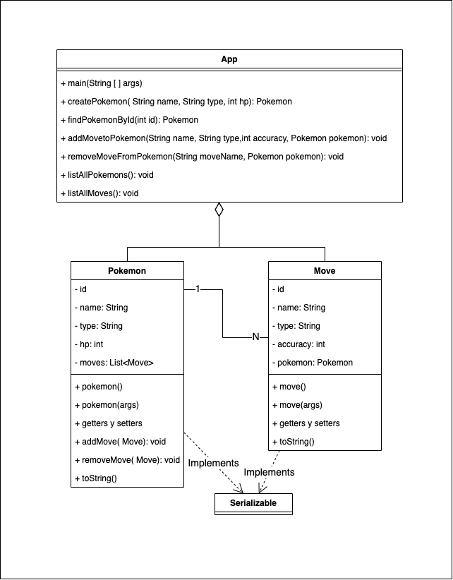

# Acceso a Datos (2DAM): Examen 2ªEv

## Instrucciones

## Enunciados
### Ejercicio 1: Hibernate (6 puntos)
Crear un conjunto de clases siguiendo el siguiente esquema:

Las clases Pokemon y Move han de implementar la clase `Serializable` y han de estar situadas en la ruta `/src/main/java/org.example/models/`

> ⚠️ Nótese que la clase Pokemon, además de getters y setter, tiene los métodos  `addMove` y `removeMove`

### Ejercicio 2: MongoDB
Realiza las siguientes consultas de Mongo
1. Consulta
1. Consulta
1. Consulta
1. Consulta

## Calificación:

Se detallan a continuación la calificación de los distintos apartados

### Ejercicio 1: Hibernate
- [0.5pt] Creación de las tablas pertinentes
- [0.5pt] Definición correcta de clase Pokemon
- [0.5pt] Definición correcta de clase Move
- [0.5pt] Implementación correcta de la relación entre ambas clases
- [1pt] Método createPokemon
- [0.5pt] Método findPokemon
- [1pt] Método addMoveToPokemon
- [1pt] Método removeMoveFromPokemon
- [0.25pt] Método listAllPokemon
- [0.25pt] Método listAllMoves

### Ejercicio 2: MongoDB
- [0.5pt] Consulta 1
- [1pt] Consulta 2
- [1pt] Consulta 3
- [1.5pt] Consulta 4

